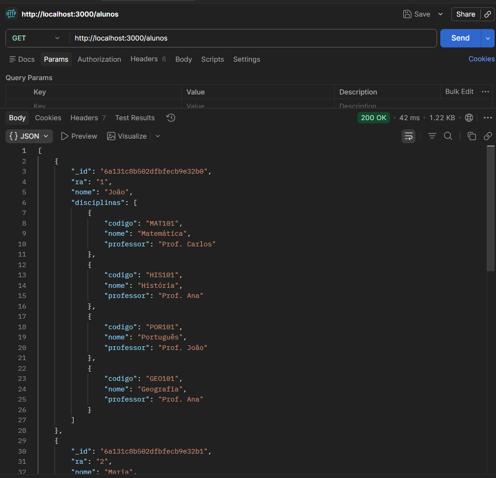
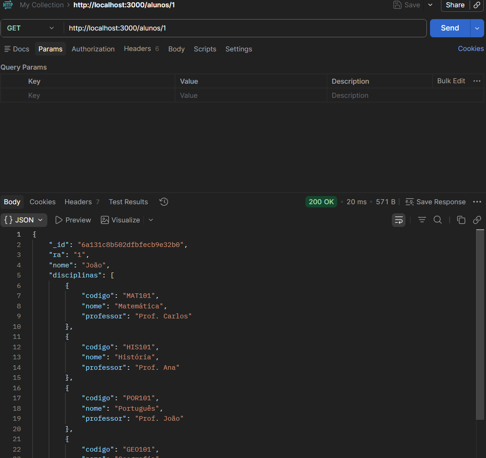
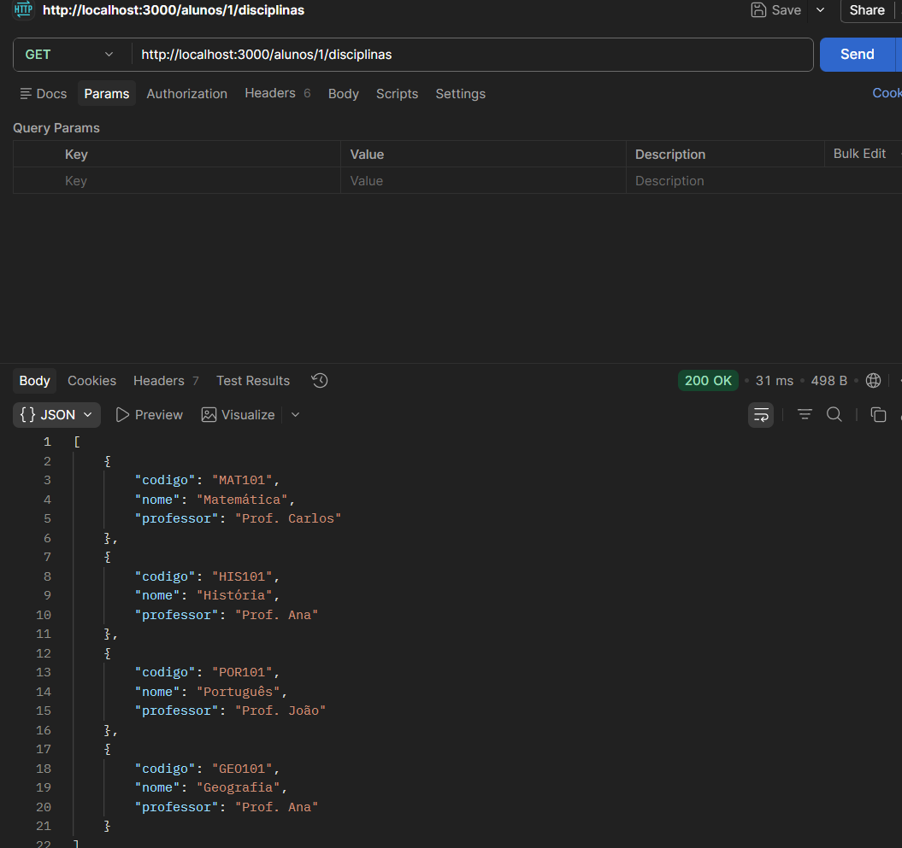
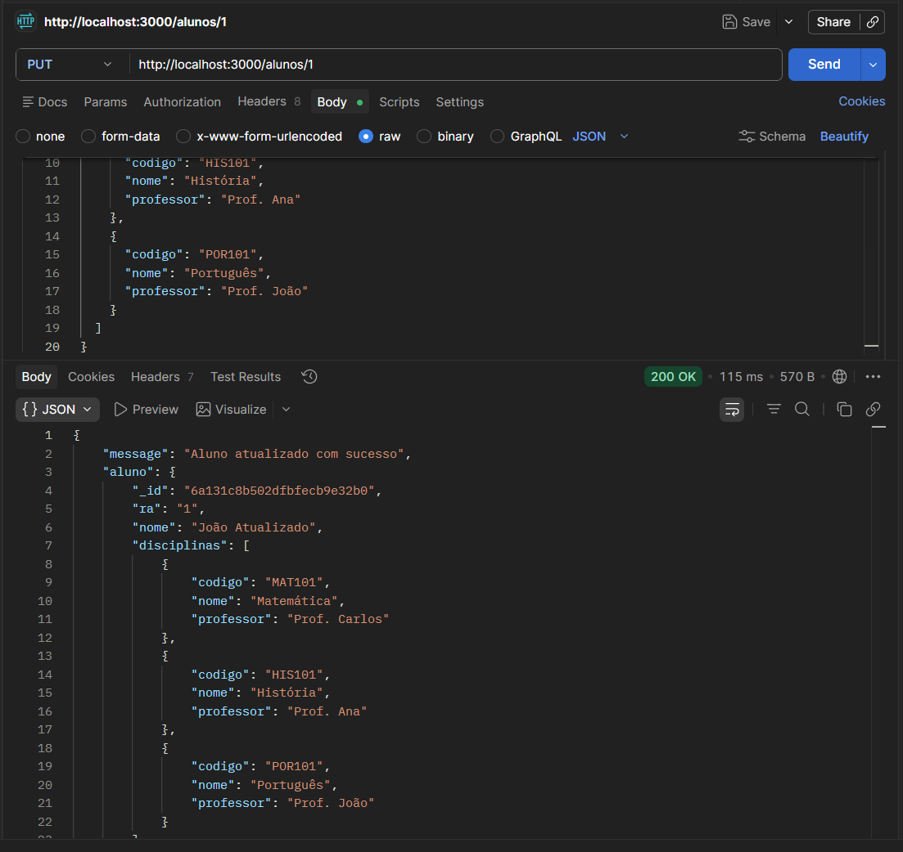

# API Escola

API desenvolvida com Node.js, Express e MongoDB para manipular dados de alunos e suas disciplinas.

O código base foi fornecido pelo professor, e foram implementados os endpoints para consultar e atualizar os dados dos alunos.

## Endpoints

### Listar todos os alunos

**Método:** `GET`

**Rota:** `/alunos`

Retorna todos os alunos cadastrados.



---

### Buscar aluno por RA

**Método:** `GET`

**Rota:** `/alunos/:ra`

Exemplo:

```http
GET /alunos/1
```

Retorna os dados de um aluno específico pelo RA.



---

### Listar disciplinas de um aluno

**Método:** `GET`

**Rota:** `/alunos/:ra/disciplinas`

Exemplo:

```http
GET /alunos/1/disciplinas
```

Retorna todas as disciplinas de um aluno específico.



---

### Atualizar dados de um aluno

**Método:** `PUT`

**Rota:** `/alunos/:ra`

Exemplo:

```http
PUT /alunos/1
```

Atualiza os dados de um aluno específico pelo RA.



---

## Testes realizados

Os testes foram realizados utilizando o Postman App.

| Método | Rota | Descrição |
|---|---|---|
| GET | `/alunos` | Lista todos os alunos |
| GET | `/alunos/:ra` | Busca um aluno pelo RA |
| GET | `/alunos/:ra/disciplinas` | Lista as disciplinas de um aluno |
| PUT | `/alunos/:ra` | Atualiza os dados de um aluno |